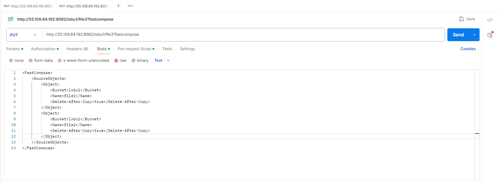
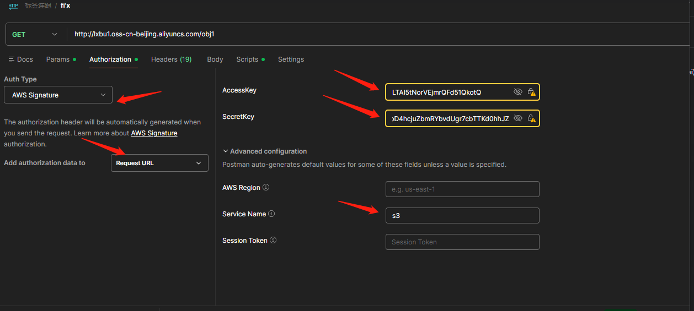

# postman闪拼对象操作
__请求url：__  
>https://endpoint:8082/{bucketname}/{dst_objname}?fastcompose  
>http://55.108.84.192:8082/lxbu1/file3?fastcompose  

请求body:

    <FastCompose>
        <SourceObjects>
            <Object>
                <Bucket>lxbu1</Bucket>
                <Name>file1</Name>
                <Delete-After-Copy>true</Delete-After-Copy>
            </Object>
            <Object>
                <Bucket>lxbu1</Bucket>
                <Name>file2</Name>
                <Delete-After-Copy>true</Delete-After-Copy>
            </Object>
        </SourceObjects>
    </FastCompose>

__可以直接把这个脚本放在postman的pre-scripts里面__

        // 计算Content-MD5
        const crypto = require('crypto-js');
        // 获取请求body
        const requestBody = pm.request.body.raw;
        if (requestBody) {
        // 计算MD5哈希
        const md5Hash = CryptoJS.MD5(requestBody).toString(CryptoJS.enc.Base64);
        // 设置Content-MD5头
        pm.request.headers.add({
        key: 'Content-MD5',
        value: md5Hash
        });
        console.log('Content-MD5:', md5Hash);
        } else {
        console.log('Request body is empty');
        }

  __配置鉴权__
