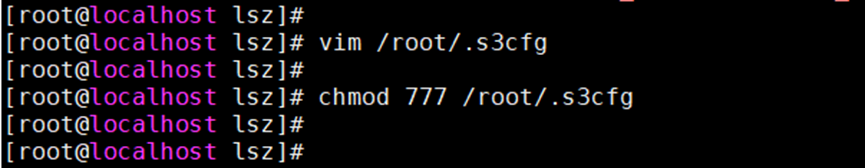
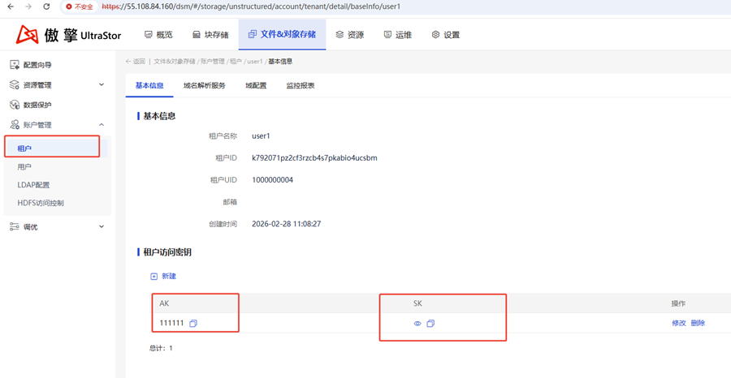
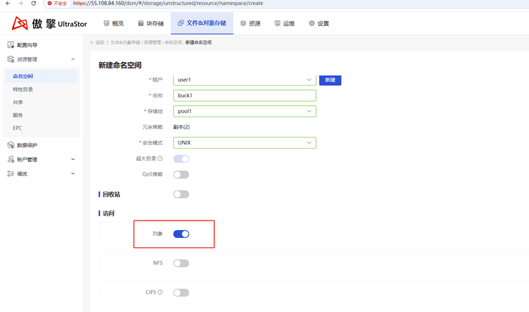
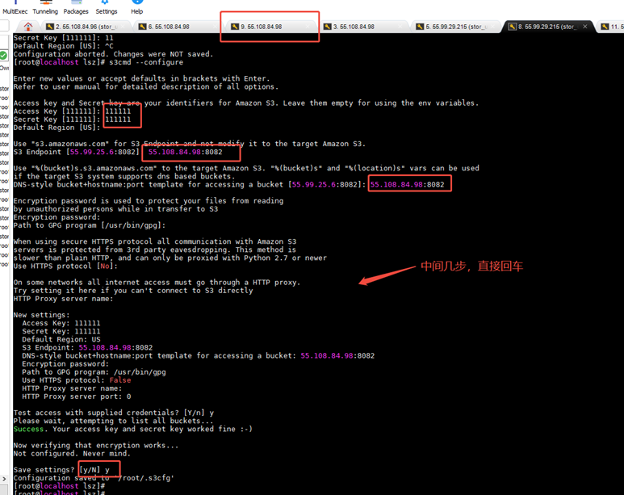

1.	上传s3cmd-2.4.0.tar.gz到客户端
2.	依次执行如下命令，安装s3cmd
tar -zxf s3cmd-2.4.0.tar.gz -C /usr/local/
mv /usr/local/s3cmd-2.4.0/ /usr/local/s3cmd/
ln -s /usr/local/s3cmd/s3cmd /usr/bin/s3cmd
3.	配置.s3cfg
 
至此，s3cmd已安装完成，下面配置租户和桶
4.	集群handy页面添加租户，手动设置ak/sk
 
5.	添加桶（新建命名空间，注意选择对象租户，打开对象开关）
 

6.	配置客户端与服务端通信
 
7.	简单测试
 
